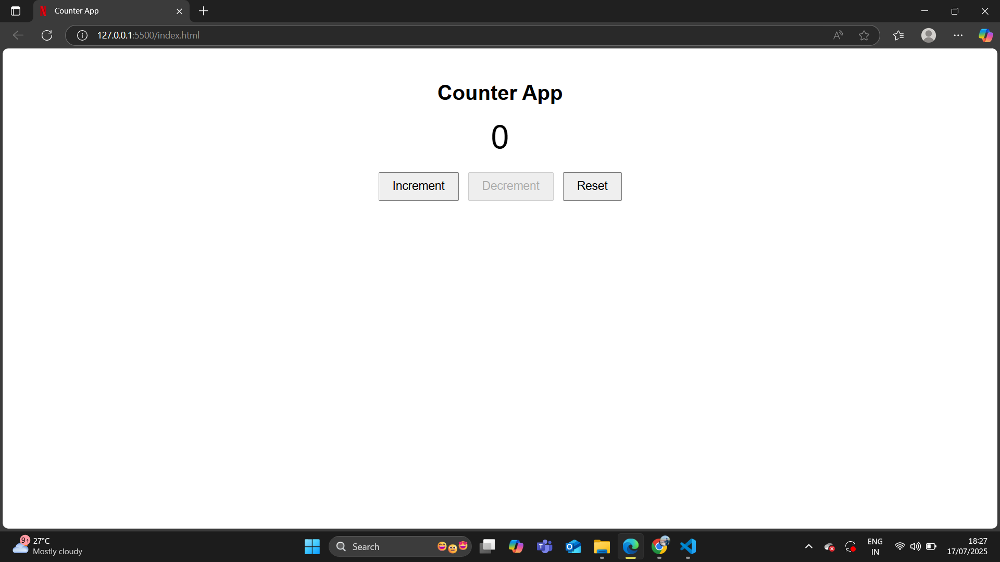

# 🔢 Counter App

A simple **Counter Application** built with **HTML, CSS, and JavaScript**.  
It allows users to **increment**, **decrement**, and **reset** the counter with a clean and responsive UI.

---

## ✅ Features
- ➕ **Increase Count** button
- ➖ **Decrease Count** button
- 🔄 **Reset Counter** button
- Responsive and minimal design
- Built using **Vanilla JavaScript** (No frameworks)

---

## 🛠 Tech Stack
- **HTML** – Structure  
- **CSS** – Styling  
- **JavaScript** – Functionality  

---

## 📸 Screenshot
 

---

## 🚀 Live Demo
[Click Here to View the App](https://num-counter-app.netlify.app/)  

---

